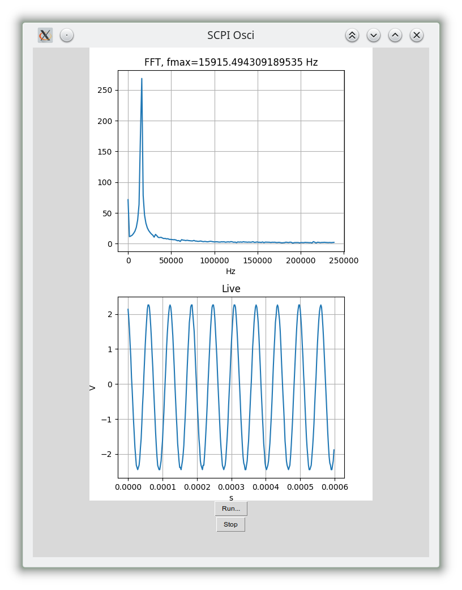

# osci-SCPI
SCPI-based oscilloscope software with live view and FFT written in python. primarily for a OWON HDS242, in future possibly more general.
Basic SCPI part started from a software (under MIT license) by Stephen Goadhouse, see https://github.com/sgoadhouse/oscope-scpi.git .

## dependencies
* python3
* tkinter
* (python3-pil.imagetk)
* pyusb
* matplotlib
* numpy
* threading

## running

start with python3, e.g.:

python3 main.py

## todos

* readout scales and adapt plot axes
* more channels
* display current settings of the device
* controls (change settings)
* data export (plot, data)
* ...
