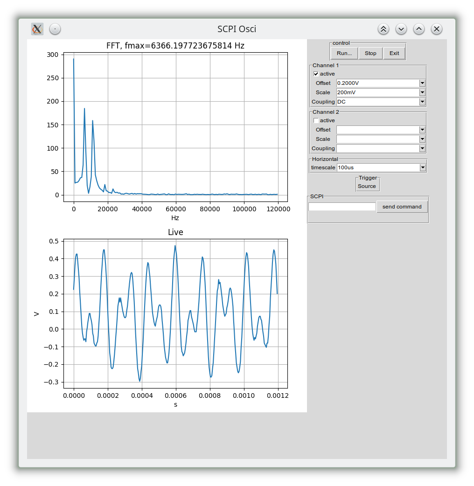

# osci-SCPI
SCPI-based oscilloscope software with live view and FFT written in python. primarily for a OWON HDS242, in future possibly more general.
Basic SCPI part started from a software (under MIT license) by Stephen Goadhouse, see https://github.com/sgoadhouse/oscope-scpi.git .

## dependencies
* python3
* tkinter
* (python3-pil.imagetk)
* pyusb
* matplotlib
* numpy
* threading

## running

1. connect the oscilloscope via USB
2. power on the oscilloscope and set it to USB HID mode
3. start the software  with python3, e.g.: python3 main.py

## USB HID mode
Set the oscilloscope to USB HID mode to use it with this software. The following steps are required (tested with owon HDS242 V8.5.0):

1.    power on
2.    press System
3.    press F4 until you are at page 2/2
4.    press F1 until it shows USB HID

## todos

* readout scales and adapt plot axes
* more channels
* display current settings of the device
* controls (change settings)
* data export (plot, data)
* ...
